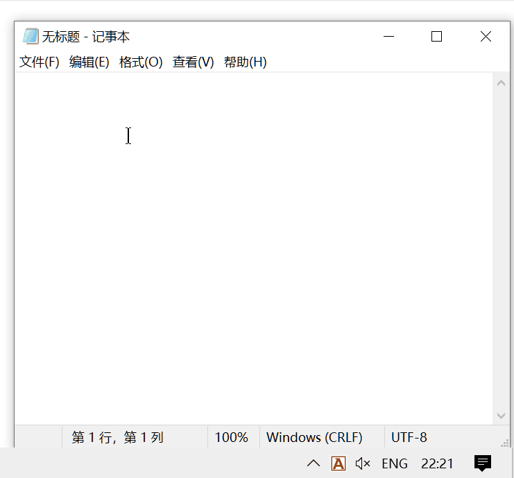

# rime.toy 
  一个在Windows 下免安装试玩Rime的输入法玩具

## 使用方法：
  运行rime.toy.exe，在窗口内打字可以在控制台中看到候选情况，像正常输入法一样选择候选，插入输入的应用中
  共享数据目录在当前目录的shared\下，用户目录在当前目录的usr\下，日志目录在当前目录log\下
  方案修改的项目，和其他rime引擎的输入法类似（建议usr下修改xxx.custom.yaml文件）

## 相关项目：
  样式文件，方案文件和opencc文件，取自 [rime/weasel](https://github.com/rime/weasel)

  后端引擎，采用 [rime/librime](https://github.com/rime/librime)

## 已知问题：
  1. 建议在英文键盘下使用，避免潜在的可能和当前的tsf输入法冲突
  2. 管理员权限下的使用，可能要使用管理员权限启动rime.toy.exe
  3. 只有简单的UI界面，窗口鼠标指针跟随（目前），兼容小狼毫的部分特性（字体/字号/配色/label_format/horizontal), 布局未兼容
  4. 可能不是所有应用中都可以输入文字

## TODO
  - [ ] 重写UI部分，实现目前小狼毫UI的全部功能，并争取更优性能
  - [ ] 输入光标跟随
  - [ ] 暂无(未想到)